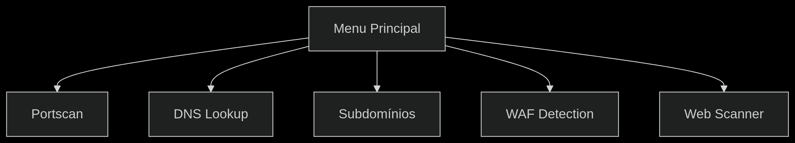

# ReconApp

## 📌 Visão Geral

O ReconApp é uma ferramenta modular de reconhecimento para testes de penetração, desenvolvida em Python. Inclui funcionalidades avançadas para:

* Varredura de portas (TCP Connect e SYN Stealth)
* Enumeração DNS completa
* Descoberta de subdomínios
* Detecção de WAF (Web Application Firewall)
* Análise de tecnologias web

## 📦 Instalação

### Pré-requisitos

* Python 3.8+
* pip
* libpcap-dev (para scan SYN)

```bash
# Clone o repositório
git clone https://github.com/seuuser/reconapp.git
cd reconapp

# Instale as dependências
pip install -r requirements.txt

# Para funcionalidade SYN Scan (opcional)
sudo apt install libpcap-dev
```

## 🚀 Como Usar

Execute o programa com:

```bash
python3 app.py
```

### Menu Interativo

```
1. Portscan (Varredura de Portas)
2. DNS Lookup (Consulta DNS)
3. Enumeração de Subdomínios
4. Detecção de WAF 
5. Scanner Web
6. Sair
```

## 📚 Manual do Usuário

### 1. Portscan

**Uso:**

```
1. Digite o IP ou rede (ex: 192.168.1.1 ou 192.168.1.0/24)
2. Intervalo de portas (ex: 1-1000) [padrão: 1-1024]
3. Número de threads [padrão: 50]
4. Modo stealth (SYN scan) [requer root]
```

**Exemplo:**

```bash
python3 app.py 1
> 192.168.1.1
> 1-1000
> 50
```

### 2. DNS Lookup

**Uso:**

```
1. Digite o domínio (ex: example.com)
2. Tipos de registro a consultar [padrão: A, MX]
```

**Exemplo:**

```bash
python3 app.py 2
> google.com
> A,MX,TXT
```

### 3. Enumeração de Subdomínios

**Uso:**

```
1. Digite o domínio base (ex: example.com)
2. Caminho para wordlist [opcional]
3. Número de threads [padrão: 20]
```

**Exemplo com wordlist:**

```bash
python3 app.py 3
> exemplo.com
> /caminho/para/wordlist.txt
```

### 4. Detecção de WAF

**Uso:**

```
1. Digite a URL ou IP (ex: https://example.com)
```

**Exemplo:**

```bash
python3 app.py 4
> https://site.com
```

### 5. Scanner Web

**Uso:**

```
1. Digite a URL (ex: https://example.com)
2. Modo agressivo? (s/N)
```

**Exemplo:**

```bash
python3 app.py 5
> http://testphp.vulnweb.com
> s
```

## 🔧 Configuração Avançada

### Wordlists Personalizadas

Coloque arquivos de wordlist em:

```
ReconApp/wordlists/
```

### Variáveis de Ambiente

Crie um arquivo `.env` para configurar:

```ini
VIRUSTOTAL_API_KEY=seu_key
SECURITYTRAILS_API_KEY=seu_key
```

## 🛠️ Desenvolvimento

### Estrutura do Projeto

```
ReconApp/
├── modules/          # Módulos principais
├── tests/            # Testes unitários
├── utils/            # Utilitários
└── app.py            # Interface principal
    requirements.txt  # Dependências
```

### Testando

```bash
# Executar todos os testes unitários
python3 -m pytest tests/

# Executar apenas testes de integração
python3 -m pytest tests/integration_test.py -v
```

## 📄 Documentação Técnica

### Fluxograma



### Dependências

| Módulo      | Função           |
| ----------- | ---------------- |
| `colorama`  | Saída colorida   |
| `dnspython` | Consultas DNS    |
| `requests`  | Requisições HTTP |
| `scapy`     | SYN Scan         |

## 📝 Relatório de Testes

### Casos de Teste Recomendados

1. **Portscan**:

   * `127.0.0.1` (localhost)
   * `192.168.1.1` (gateway)

2. **DNS**:

   * `google.com` (vários registros)
   * `example.com` (registros básicos)

3. **Subdomínios**:

   * `exemplo.com` (com wordlist)
   * `teste.org` (sem wordlist)

4. **WAF**:

   * `https://cloudflare.com` (WAF detectável)
   * `http://exemplo.com` (sem WAF)