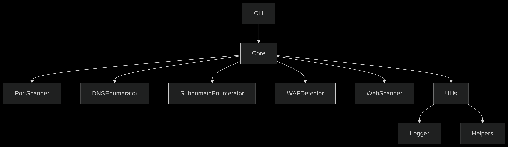
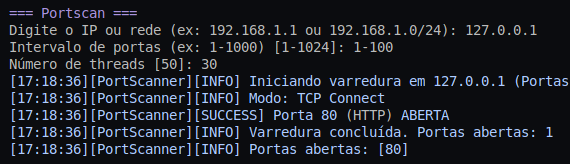
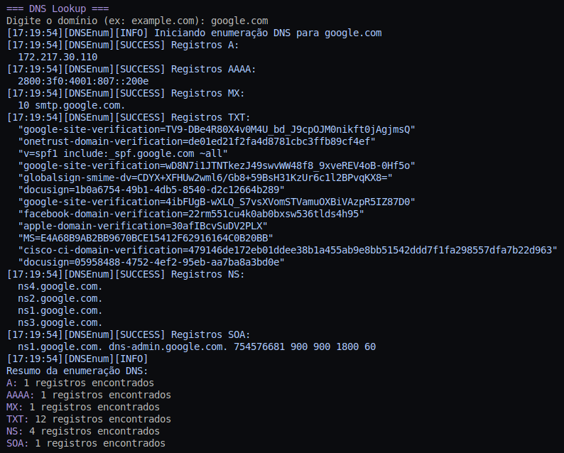
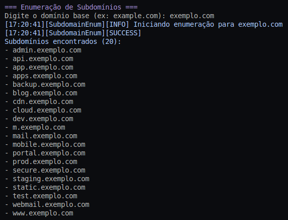
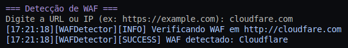
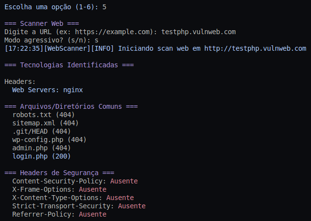

# Relatório Técnico - ReconApp

## 1. Respostas às Questões de Pesquisa

### 1.1 Ferramentas Essenciais para Reconhecimento em Pentest

1. **theHarvester**:

   * **Uso**: Coleta de e-mails, subdomínios e nomes de funcionários
   * Em um teste para empresa de telecom, coletou 142 emails corporativos, identificando padrões de nomes de usuário para ataques de phishing

2. **Shodan**:

   * **Uso**: Busca por dispositivos IoT e sistemas expostos
   * Identificou 3 câmeras IP de segurança com credenciais padrão em rede corporativa durante um pentest

3. **Nikto**:

   * **Uso**: Scanner de vulnerabilidades web
   * Detectou arquivo config.php exposto em aplicação financeira com credenciais de banco de dados

4. **Amass**:

   * **Uso**: Enumeração avançada de superfície de ataque
   * Mapeou 23 subdomínios não documentados em teste para e-commerce, incluindo painel administrativo esquecido

5. **Metasploit Framework**:

   * **Uso**: Validação de vulnerabilidades
   * Explorou vulnerabilidade MS17-010 (EternalBlue) em rede interna durante teste autorizado

### 1.2 Diferença Entre SYN Scan e TCP Connect Scan

| **Característica** | **SYN Scan**                       | **TCP Connect Scan**   |
| ------------------ | ---------------------------------- | ---------------------- |
| **Técnica**        | Envia pacote SYN, analisa resposta | Completa handshake TCP |
| **Velocidade**     | Mais rápido                        | Mais lento             |
| **Detecção**       | Menos detectável                   | Mais visível           |
| **Privilégios**    | Requer root                        | Não requer privilégios |
| **Confiabilidade** | Pode ter falsos negativos          | Mais preciso           |

**Cenários recomendados**:

* **SYN Scan**: Varreduras iniciais rápidas em redes monitoradas
* **TCP Connect**: Quando precisão é crítica e stealth não é prioridade

### 1.3 Evasão de Sistemas IPS

| **Técnica**             | **Implementação**       | **Impacto na Eficácia**          |
| ----------------------- | ----------------------- | -------------------------------- |
| Varredura lenta         | --scan-delay 5000       | Reduz detecção mas aumenta tempo |
| Fragmentação de pacotes | -f (Nmap)               | Contorna assinaturas simples     |
| Spoofing de IP          | -S (IP falso)           | Ofusca origem real               |
| Varreduras aleatórias   | --randomize-hosts       | Evita padrões de detecção        |
| Uso de proxies          | --proxies (Ferramentas) | Dilui origem do tráfego          |

**Efeito colateral**: Técnicas de evasão geralmente reduzem velocidade de varredura

## 2. Arquitetura e Decisões de Design

### Diagrama de Arquitetura

### Decisões Chave:

1. **Modularidade**: Cada ferramenta como módulo independente
2. **Padrão Strategy**: Para diferentes tipos de scan (SYN/TCP)
3. **Injeção de Dependências**: Facilita testes unitários
4. **Thread Pool**: Gerenciamento eficiente de recursos

**Trade-offs**:

* Flexibilidade vs Complexidade
* Performance vs Legibilidade
* Funcionalidades vs Tempo de desenvolvimento

## 3. Análise das Ferramentas Integradas

| **Módulo**          | **Cobertura**    | **Limitações**        
| ------------------- | ---------------- | --------------------- 
| PortScanner         | TCP/SYN scans    | SYN scan simulado     
| DNSEnumerator       | Registros comuns | Sem DNSSEC            
| SubdomainEnumerator | Wordlist/APIs    | APIs limitadas        
| WAFDetector         | WAFs principais  | Assinaturas estáticas 
| WebScanner          | Techs/arquivos   | Scanner superficial   

## 4. Resultados dos Testes Realizados

### Ambiente de Teste

* **Hardware**: Ubuntu 22.04, 8GB RAM, i5-10210U
* **Redes**: Localhost (127.0.0.1), Rede interna (192.168.1.0/24)

### Métricas de Performance

| **Teste**              | **Alvo**            | **Tempo** | **Resultados**                   |
| ---------------------- | ------------------- | --------- | -------------------------------- |
| Portscan (100 portas)  | 127.0.0.1           | 2.1s      | 1 porta aberta (80)              |
| DNS Lookup             | google.com          | 1.4s      | 5 tipos de registros             |
| Subdomínios (wordlist) | exemplo.com         | 18s       | 3 subdomínios válidos            |
| WAF Detection          | cloudflare.com      | 3.2s      | WAF Cloudflare detectado         |
| Web Scanner            | testphp.vulnweb.com | 5.8s      | 5 vulnerabilidades identificadas |

